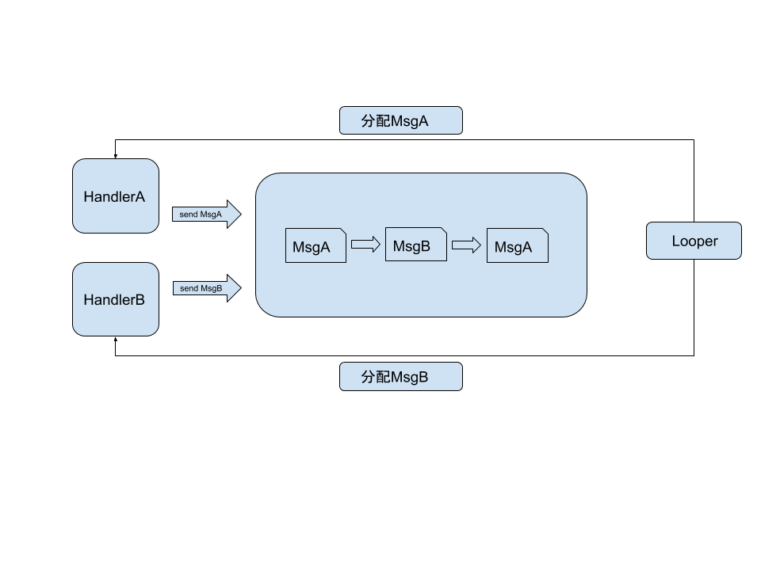

> 本文基于Android源码8.1


## 概述
我们平时使用Handler一般是在工作线程中更新UI线程时使用，说白了它是一种线程间的消息传递机制，当然了它是限制在同
一个进程中。另外，我们所说的Handler消息机制是由Looper、MessageQueue、Message、Handler等类共同组成的。Handler
消息机制在Android的事件传递等方面有着广泛的使用，如果不理解Handler消息机制，就很难对Android的整个运行流程有个清晰的认识.



上图这个就是整个handler消息机制最核心原理。


## handler实例
下面先看一个handler的简单实用，通过这个这个例子，我们一步一步去探究handler机制的整个运行的流程。

···

private void handlerTest(){

       final LooperThread looperThread = new LooperThread("xray");
       looperThread.start();
       findViewById(R.id.btn_send_msg).setOnClickListener(new View.OnClickListener() {
           @Override
           public void onClick(View v) {
               looperThread.mHandler.sendEmptyMessage(10);
           }
       });


   }

   class LooperThread extends Thread{

       public Handler mHandler;

       public LooperThread(String name) {
           super(name);
       }

       @Override
       public void run() {
           super.run();

           Looper.prepare();

           mHandler = new Handler(){
               @Override
               public void handleMessage(Message msg) {
                   super.handleMessage(msg);
                   Log.d(TAG, "looperThread thread id = " + Thread.currentThread().getId());
               }
           };
           Looper.loop();
       }
   }


···


## Looper

通过上面的例子，我们在一个线程中创建handler的时候，首先得调用Looper.prepare()方法。


```
//Looper.java

/** Initialize the current thread as a looper.
      * This gives you a chance to create handlers that then reference
      * this looper, before actually starting the loop. Be sure to call
      * {@link #loop()} after calling this method, and end it by calling
      * {@link #quit()}.
      */
    public static void prepare() {
        prepare(true);
    }

    private static void prepare(boolean quitAllowed) {
        if (sThreadLocal.get() != null) {
            throw new RuntimeException("Only one Looper may be created per thread");
        }
        sThreadLocal.set(new Looper(quitAllowed));
    }

```
除了prepare()方法外，还有一个带参数的同名方法，这个参数判断我们是否可以主动退出loop()循环，等一会我们讲到
loop()方法的时候会对这个参数有更深的理解。然后prepare方法创建了Looper对象,然后将其实例保存在了sThreadLocal
这个成员变量中。关于ThreadLocal的作用和原理请看下面的小节。

下面看看Looper的构造方法中做什么。

```
private Looper(boolean quitAllowed) {
        mQueue = new MessageQueue(quitAllowed);
        mThread = Thread.currentThread();
    }

```
我们发现在Looper的构造方法中，创建了MessageQueue,俗称消息队列，这个是handler消息机制的另外一个主人公。我们稍后会着重的对它
进行介绍。

现在我们回到上面的例子，我们先不管Handler的创建,看Looper.loop()方法.

```

//Looper.java

/**
    * Run the message queue in this thread. Be sure to call
    * {@link #quit()} to end the loop.
    */
   public static void loop() {
       final Looper me = myLooper();
       if (me == null) {
           throw new RuntimeException("No Looper; Looper.prepare() wasn't called on this thread.");
       }
       final MessageQueue queue = me.mQueue;

       // Make sure the identity of this thread is that of the local process,
       // and keep track of what that identity token actually is.
       Binder.clearCallingIdentity();
       final long ident = Binder.clearCallingIdentity();

       for (;;) {
           Message msg = queue.next(); // 可能会阻塞在这里
           if (msg == null) {
               // No message indicates that the message queue is quitting.
               //如果没有message说明消息队列正在退出
               return;
           }

           // This must be in a local variable, in case a UI event sets the logger
           final Printer logging = me.mLogging;
           if (logging != null) {
               logging.println(">>>>> Dispatching to " + msg.target + " " +
                       msg.callback + ": " + msg.what);
           }

           final long slowDispatchThresholdMs = me.mSlowDispatchThresholdMs;

           final long traceTag = me.mTraceTag;
           if (traceTag != 0 && Trace.isTagEnabled(traceTag)) {
               Trace.traceBegin(traceTag, msg.target.getTraceName(msg));
           }
           final long start = (slowDispatchThresholdMs == 0) ? 0 : SystemClock.uptimeMillis();
           final long end;
           try {
              //从消息队列中得到消息后，要将消息进行分发处理，这个target大多数就是handler
               msg.target.dispatchMessage(msg);
               end = (slowDispatchThresholdMs == 0) ? 0 : SystemClock.uptimeMillis();
           } finally {
               if (traceTag != 0) {
                   Trace.traceEnd(traceTag);
               }
           }
           if (slowDispatchThresholdMs > 0) {
               final long time = end - start;
               if (time > slowDispatchThresholdMs) {
                   Slog.w(TAG, "Dispatch took " + time + "ms on "
                           + Thread.currentThread().getName() + ", h=" +
                           msg.target + " cb=" + msg.callback + " msg=" + msg.what);
               }
           }

           if (logging != null) {
               logging.println("<<<<< Finished to " + msg.target + " " + msg.callback);
           }

           // Make sure that during the course of dispatching the
           // identity of the thread wasn't corrupted.
           final long newIdent = Binder.clearCallingIdentity();
           if (ident != newIdent) {
               Log.wtf(TAG, "Thread identity changed from 0x"
                       + Long.toHexString(ident) + " to 0x"
                       + Long.toHexString(newIdent) + " while dispatching to "
                       + msg.target.getClass().getName() + " "
                       + msg.callback + " what=" + msg.what);
           }
          //消息进行回收
           msg.recycleUnchecked();//todo，介绍消息回收的方式
       }
   }

```

#### mylooper()

```
/**
    * Return the Looper object associated with the current thread.  Returns
    * null if the calling thread is not associated with a Looper.
    */
   public static @Nullable Looper myLooper() {
       return sThreadLocal.get();
   }

```

#### quit()和quitSafely()

```
/**
    * Quits the looper.
    * <p>
    * Causes the {@link #loop} method to terminate without processing any
    * more messages in the message queue.
    * </p><p>
    * Any attempt to post messages to the queue after the looper is asked to quit will fail.
    * For example, the {@link Handler#sendMessage(Message)} method will return false.
    * </p><p class="note">
    * Using this method may be unsafe because some messages may not be delivered
    * before the looper terminates.  Consider using {@link #quitSafely} instead to ensure
    * that all pending work is completed in an orderly manner.
    * </p>
    *
    * @see #quitSafely
    */
   public void quit() {
       mQueue.quit(false);
   }

   /**
    * Quits the looper safely.
    * <p>
    * Causes the {@link #loop} method to terminate as soon as all remaining messages
    * in the message queue that are already due to be delivered have been handled.
    * However pending delayed messages with due times in the future will not be
    * delivered before the loop terminates.
    * </p><p>
    * Any attempt to post messages to the queue after the looper is asked to quit will fail.
    * For example, the {@link Handler#sendMessage(Message)} method will return false.
    * </p>
    */
   public void quitSafely() {
       mQueue.quit(true);
   }

```

这个两个方法调用的都是MessageQueue中的方法，具体见todo


## MessageQueue


#### next()

next方法的作用就是从消息队列中取出Message,当然具体不是一句话这么简单，下面看看其内部的实现。

```
//MessageQueue.java

Message next() {
        // Return here if the message loop has already quit and been disposed.
        // This can happen if the application tries to restart a looper after quit
        // which is not supported.
        final long ptr = mPtr;
        if (ptr == 0) {
            return null;
        }

        int pendingIdleHandlerCount = -1; // -1 only during first iteration
        int nextPollTimeoutMillis = 0;
        for (;;) {
            if (nextPollTimeoutMillis != 0) {
                Binder.flushPendingCommands();
            }

            nativePollOnce(ptr, nextPollTimeoutMillis);

            synchronized (this) {
                // Try to retrieve the next message.  Return if found.
                final long now = SystemClock.uptimeMillis();
                Message prevMsg = null;
                Message msg = mMessages;
                if (msg != null && msg.target == null) {
                    // Stalled by a barrier.  Find the next asynchronous message in the queue.
                    do {
                        prevMsg = msg;
                        msg = msg.next;
                    } while (msg != null && !msg.isAsynchronous());
                }
                if (msg != null) {
                    if (now < msg.when) {
                        // Next message is not ready.  Set a timeout to wake up when it is ready.
                        //如果下一条message被延时，设置一个延时，等时间到了再去返回该Message
                        nextPollTimeoutMillis = (int) Math.min(msg.when - now, Integer.MAX_VALUE);
                    } else {
                        // Got a message.
                        mBlocked = false;
                        if (prevMsg != null) {
                            prevMsg.next = msg.next;
                        } else {
                            mMessages = msg.next;
                        }
                        msg.next = null;
                        if (DEBUG) Log.v(TAG, "Returning message: " + msg);
                        msg.markInUse();
                        return msg;
                    }
                } else {
                    // No more messages.
                    nextPollTimeoutMillis = -1;
                }

                // Process the quit message now that all pending messages have been handled.
                if (mQuitting) {
                    dispose();
                    return null;
                }

                // If first time idle, then get the number of idlers to run.
                // Idle handles only run if the queue is empty or if the first message
                // in the queue (possibly a barrier) is due to be handled in the future.
                if (pendingIdleHandlerCount < 0
                        && (mMessages == null || now < mMessages.when)) {
                    pendingIdleHandlerCount = mIdleHandlers.size();
                }
                if (pendingIdleHandlerCount <= 0) {
                    // No idle handlers to run.  Loop and wait some more.
                    mBlocked = true;
                    //如果没有idle handlers需要执行，Loop将输入等待状态，也就是，next方法处于阻塞的状态，此处执行调到下一次循环，
                    //直到有新的消息，或者loop被终止，或则有idle handlers 需要执行
                    continue;
                }

                if (mPendingIdleHandlers == null) {
                    mPendingIdleHandlers = new IdleHandler[Math.max(pendingIdleHandlerCount, 4)];
                }
                mPendingIdleHandlers = mIdleHandlers.toArray(mPendingIdleHandlers);
            }

            // Run the idle handlers.
            // We only ever reach this code block during the first iteration.
            for (int i = 0; i < pendingIdleHandlerCount; i++) {
                final IdleHandler idler = mPendingIdleHandlers[i];
                mPendingIdleHandlers[i] = null; // release the reference to the handler

                boolean keep = false;
                try {
                    keep = idler.queueIdle();
                } catch (Throwable t) {
                    Log.wtf(TAG, "IdleHandler threw exception", t);
                }

                if (!keep) {
                    synchronized (this) {
                        mIdleHandlers.remove(idler);
                    }
                }
            }

            // Reset the idle handler count to 0 so we do not run them again.
            //重置idle handler的个数为0, 需要等下次再没有可执行的Message执行时，idle handler才能继续执行
            pendingIdleHandlerCount = 0;

            // While calling an idle handler, a new message could have been delivered
            // so go back and look again for a pending message without waiting.
            //需要重置这个过期时间，因为有可能有新的message需要执行，所以需要的检查
            nextPollTimeoutMillis = 0;
        }
    }


```

#### enqueueMessage

enqueueMessage方法的作用是往消息队列中添加消息，这里我们发现MessageQueue的队列是用链表实现的，
另外在插入的时候会以消息执行的时间进行排序。下面我们看看具体的代码实现。

```
//MessageQueue.java

boolean enqueueMessage(Message msg, long when) {
    if (msg.target == null) {
        throw new IllegalArgumentException("Message must have a target.");
    }
    if (msg.isInUse()) {
        throw new IllegalStateException(msg + " This message is already in use.");
    }

    synchronized (this) {
        if (mQuitting) {
            IllegalStateException e = new IllegalStateException(
                    msg.target + " sending message to a Handler on a dead thread");
            Log.w(TAG, e.getMessage(), e);
            msg.recycle();//回收message todo
            return false;
        }

        msg.markInUse();
        msg.when = when;
        Message p = mMessages;
        boolean needWake;
        if (p == null || when == 0 || when < p.when) {
            // New head, wake up the event queue if blocked.
            msg.next = p;
            mMessages = msg;
            needWake = mBlocked;
        } else {
            // Inserted within the middle of the queue.  Usually we don't have to wake
            // up the event queue unless there is a barrier at the head of the queue
            // and the message is the earliest asynchronous message in the queue.
            needWake = mBlocked && p.target == null && msg.isAsynchronous();
            Message prev;
            //按时间去排序，将message插入到队列相应的位置
            for (;;) {
                prev = p;
                p = p.next;
                if (p == null || when < p.when) {
                    break;
                }
                if (needWake && p.isAsynchronous()) {
                    needWake = false;
                }
            }
            msg.next = p; // invariant: p == prev.next
            prev.next = msg;
        }

        // We can assume mPtr != 0 because mQuitting is false.
        if (needWake) {
            nativeWake(mPtr);
        }
    }
    return true;
}


```
对于延时的消息,MessageQueue会遍历整个链表，直到找到合适的插入的位置。


## Message

Message顾名思义是handler消息机制中的那个消息，handler发送和处理的实体就是这个Message.

#### obtain()

当我们平时需要Message实例时，可以直接的new Message(),也可以调用Message的obtain()方法，但是更推荐
使用后者，因为Message中有个Message的缓存池，这个缓存池的大小时50，从MAX_POOL_SIZE这个常量值可以得到，
所以obtain()方法先会从sPool的链表中获取Message实例，如果没有的话才会
new Message()

```

public static Message obtain() {
        synchronized (sPoolSync) {
            if (sPool != null) {
              //message pool也是用链表实现的
                Message m = sPool;
                sPool = m.next;
                m.next = null;
                m.flags = 0; // clear in-use flag
                sPoolSize--;
                return m;
            }
        }
        return new Message();
    }


```

#### recycle()和recycleUnchecked()

这两个方法的作用是将使用完的Message对象进行回收，重新放入都Message缓存池中，以便下次使用，其实代码很简单，
主要还是对链表的操作，有没有发现链表这种数据结构真的使用的很多。

```
/**
     * Return a Message instance to the global pool.
     * <p>
     * You MUST NOT touch the Message after calling this function because it has
     * effectively been freed.  It is an error to recycle a message that is currently
     * enqueued or that is in the process of being delivered to a Handler.
     * </p>
     */
    public void recycle() {
        if (isInUse()) {
            if (gCheckRecycle) {
                throw new IllegalStateException("This message cannot be recycled because it "
                        + "is still in use.");
            }
            return;
        }
        recycleUnchecked();
    }

    /**
     * 该方法可能回收还在使用的Message
     */
    void recycleUnchecked() {
        // Mark the message as in use while it remains in the recycled object pool.
        // Clear out all other details.
        flags = FLAG_IN_USE;
        what = 0;
        arg1 = 0;
        arg2 = 0;
        obj = null;
        replyTo = null;
        sendingUid = -1;
        when = 0;
        target = null;
        callback = null;
        data = null;

        synchronized (sPoolSync) {
            if (sPoolSize < MAX_POOL_SIZE) {//Message缓存池大小为50
                next = sPool;
                sPool = this;
                sPoolSize++;
            }
        }
    }

```


## Handler

Handler在整个handler消息机制中的作用是，Message的发送和处理。


#### Handler构造方法

```

public Handler(Callback callback, boolean async) {

      //是否检测内存泄漏的风险
      if (FIND_POTENTIAL_LEAKS) {
          final Class<? extends Handler> klass = getClass();
          if ((klass.isAnonymousClass() || klass.isMemberClass() || klass.isLocalClass()) &&
                  (klass.getModifiers() & Modifier.STATIC) == 0) {
              Log.w(TAG, "The following Handler class should be static or leaks might occur: " +
                  klass.getCanonicalName());
          }
      }

      mLooper = Looper.myLooper();//从当前的线程中获取Looper, todo
      if (mLooper == null) {//在线程中创建handle时，需要先调用Looper.prepare()
          throw new RuntimeException(
              "Can't create handler inside thread that has not called Looper.prepare()");
      }
      mQueue = mLooper.mQueue; //Looper中创建的消息队列
      mCallback = callback;//处理message的回调
      mAsynchronous = async;
  }


```


#### 发送Message

上面说了Handler中处理发送消息和分发消息的任务，下面看看它的具体实现。

```
public boolean sendMessageAtTime(Message msg, long uptimeMillis) {
    MessageQueue queue = mQueue;
    if (queue == null) {
        RuntimeException e = new RuntimeException(
                this + " sendMessageAtTime() called with no mQueue");
        Log.w("Looper", e.getMessage(), e);
        return false;
    }
    return enqueueMessage(queue, msg, uptimeMillis);
}


```


```

private boolean enqueueMessage(MessageQueue queue, Message msg, long uptimeMillis) {
       msg.target = this;
       if (mAsynchronous) {
           msg.setAsynchronous(true);
       }
       return queue.enqueueMessage(msg, uptimeMillis);
   }

```

发送消息其实最终就是将Message根据Message的执行时间插入到MessageQueue中，具体可以看[todo]中的逻辑


#### 分发消息

Looper在调用loop()方法的时候，当遇到符合条件的Message，就会调用Handler的dispatchMessage方法，
用来分发Message，这用我们我们就可以在Handler中处理Message了。


```

/**
   * Handle system messages here.
   */
  public void dispatchMessage(Message msg) {
      if (msg.callback != null) {
          handleCallback(msg);
      } else {
          if (mCallback != null) {
              if (mCallback.handleMessage(msg)) {
                  return;
              }
          }
          handleMessage(msg);
      }
  }

```
