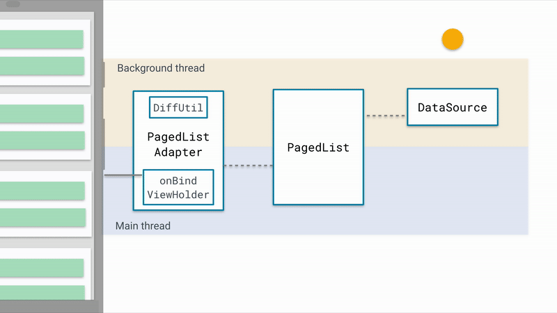

## 简述
paging是jetpack中一个处理分页的组件，它和RecyclerView有着很好的兼容性，但是在做TV开发使用Leanback的时候，
遇到了一些问题，那就是paging中使用的adapter是RecyclerView的adapter,但是leanback中使用的adapter则不是
,所以需要对paging的源码做一定的修改，既然要修改，就需要对paging有个深入的了解,
下面就深入paging的源码看看。





## DataSource

它是对数据来源的封装，可以是本地数据源（比如：本地数据库Room、Realm等）也可以是远程的接口，也可以两者兼而有之。另外paging还提供了三种不同类型的DataSource，它们都继承了DataSource这个抽象类。


#### PositionalDataSource

基于固定大小的数据源，根据position位置去获取数据的方式，例如，在滚动联系人列表中跳转到列表中的特定位置（即跳转到以特定字母开头的联系人）


#### ItemKeyedDataSource

根据Key去加载特定的Item，比如通过第N个Item的id,去加载第N+1个Item

#### PageKeyedDataSource

根据页码信息去获取item。其中key为页码信息


## PagedList

这个类的作用是负责从DataSource中获取数据，然后加载到ui上。它负责怎么加载，比如首页加载和分页加载的配置等。

```


```


## PagedListAdapter

负责ui的展示，和RecyclerView中Adapter的作用类似，但是他会触发加载更多的逻辑。


## PagedListAdapter

他是paging中提供的adapter，继承的是RecyclerView的adapter.但是他里面的逻辑主要是交给AsyncPagedListDiffer
类去处理了。在创建PagedListAdapter的时候，需要传入一个DiffUtil.ItemCallback，这个参数的作用是提供RecyclerView
中对新旧数据进行diff计算的条件。


```
public abstract class PagedListAdapter<T, VH extends RecyclerView.ViewHolder>
        extends RecyclerView.Adapter<VH> {
    private final AsyncPagedListDiffer<T> mDiffer;
    private final AsyncPagedListDiffer.PagedListListener<T> mListener =
            new AsyncPagedListDiffer.PagedListListener<T>() {
        @Override
        public void onCurrentListChanged(@Nullable PagedList<T> currentList) {
            PagedListAdapter.this.onCurrentListChanged(currentList);
        }
    };

    /**
     * Creates a PagedListAdapter with default threading and
     * {@link android.support.v7.util.ListUpdateCallback}.
     *
     * Convenience for {@link #PagedListAdapter(AsyncDifferConfig)}, which uses default threading
     * behavior.
     *
     * @param diffCallback The {@link DiffUtil.ItemCallback DiffUtil.ItemCallback} instance to
     *                     compare items in the list.
     */
    protected PagedListAdapter(@NonNull DiffUtil.ItemCallback<T> diffCallback) {
        mDiffer = new AsyncPagedListDiffer<>(this, diffCallback);
        mDiffer.mListener = mListener;
    }

    @SuppressWarnings("unused, WeakerAccess")
    protected PagedListAdapter(@NonNull AsyncDifferConfig<T> config) {
        mDiffer = new AsyncPagedListDiffer<>(new AdapterListUpdateCallback(this), config);
        mDiffer.mListener = mListener;
    }

    /**
     * Set the new list to be displayed.
     * <p>
     * If a list is already being displayed, a diff will be computed on a background thread, which
     * will dispatch Adapter.notifyItem events on the main thread.
     *
     * @param pagedList The new list to be displayed.
     */
    public void submitList(PagedList<T> pagedList) {
        mDiffer.submitList(pagedList);
    }

    @Nullable
    protected T getItem(int position) {
        return mDiffer.getItem(position);
    }

    @Override
    public int getItemCount() {
        return mDiffer.getItemCount();
    }

    /**
     * Returns the PagedList currently being displayed by the Adapter.
     * <p>
     * This is not necessarily the most recent list passed to {@link #submitList(PagedList)},
     * because a diff is computed asynchronously between the new list and the current list before
     * updating the currentList value. May be null if no PagedList is being presented.
     *
     * @return The list currently being displayed.
     */
    @Nullable
    public PagedList<T> getCurrentList() {
        return mDiffer.getCurrentList();
    }

    /**
     * Called when the current PagedList is updated.
     * <p>
     * This may be dispatched as part of {@link #submitList(PagedList)} if a background diff isn't
     * needed (such as when the first list is passed, or the list is cleared). In either case,
     * PagedListAdapter will simply call
     * {@link #notifyItemRangeInserted(int, int) notifyItemRangeInserted/Removed(0, mPreviousSize)}.
     * <p>
     * This method will <em>not</em>be called when the Adapter switches from presenting a PagedList
     * to a snapshot version of the PagedList during a diff. This means you cannot observe each
     * PagedList via this method.
     *
     * @param currentList new PagedList being displayed, may be null.
     */
    @SuppressWarnings("WeakerAccess")
    public void onCurrentListChanged(@Nullable PagedList<T> currentList) {
    }
}


```

## 设置数据
上面已经提到了PagedListAdapter中的主要逻辑都是AsyncPagedListDiffer来完成的，我们先看看submitList，这个方法的主要作用是通过RecyclerView中DiffUtil工具对比新旧数据的差异，通过差异结果高效的刷新ui，
关于DiffUtil的使用和原理介绍可以看我之前的[文章](https://github.com/chengfangpeng/Note/blob/master/2_cs/7_blog/RecyclerView%E5%B1%80%E9%83%A8%E5%88%B7%E6%96%B0%E5%92%8CDiff%E7%AE%97%E6%B3%95.md)。


```

AsyncPagedListDiffer.java

public void submitList(final PagedList<T> pagedList) {
        if (pagedList != null) {
            if (mPagedList == null && mSnapshot == null) {
                mIsContiguous = pagedList.isContiguous();
            } else {
                if (pagedList.isContiguous() != mIsContiguous) {
                    throw new IllegalArgumentException("AsyncPagedListDiffer cannot handle both"
                            + " contiguous and non-contiguous lists.");
                }
            }
        }

        if (pagedList == mPagedList) {
            // 如果新旧数据相同，则什么都不做
            return;
        }

        // incrementing generation means any currently-running diffs are discarded when they finish
        final int runGeneration = ++mMaxScheduledGeneration;

        if (pagedList == null) {
            int removedCount = getItemCount();
            if (mPagedList != null) {
                mPagedList.removeWeakCallback(mPagedListCallback);
                mPagedList = null;
            } else if (mSnapshot != null) {
                mSnapshot = null;
            }
            // dispatch update callback after updating mPagedList/mSnapshot
            //如果传入的数据为null，则将原始数据全部清除完
            mUpdateCallback.onRemoved(0, removedCount);
            if (mListener != null) {
                mListener.onCurrentListChanged(null);
            }
            return;
        }

        if (mPagedList == null && mSnapshot == null) {
            // fast simple first insert
            mPagedList = pagedList;
            pagedList.addWeakCallback(null, mPagedListCallback);

            // dispatch update callback after updating mPagedList/mSnapshot
            //如果原始数据为null,则直接将新加的数据插入
            mUpdateCallback.onInserted(0, pagedList.size());

            if (mListener != null) {
                mListener.onCurrentListChanged(pagedList);
            }
            return;
        }

        if (mPagedList != null) {
            // first update scheduled on this list, so capture mPages as a snapshot, removing
            // callbacks so we don't have resolve updates against a moving target
            mPagedList.removeWeakCallback(mPagedListCallback);
            mSnapshot = (PagedList<T>) mPagedList.snapshot();
            mPagedList = null;
        }

        if (mSnapshot == null || mPagedList != null) {
            throw new IllegalStateException("must be in snapshot state to diff");
        }

        final PagedList<T> oldSnapshot = mSnapshot;
        final PagedList<T> newSnapshot = (PagedList<T>) pagedList.snapshot();
        //在工作线程中做新旧数据的对比工作
        mConfig.getBackgroundThreadExecutor().execute(new Runnable() {
            @Override
            public void run() {
                final DiffUtil.DiffResult result;
                result = PagedStorageDiffHelper.computeDiff(
                        oldSnapshot.mStorage,
                        newSnapshot.mStorage,
                        mConfig.getDiffCallback());

                mMainThreadExecutor.execute(new Runnable() {
                    @Override
                    public void run() {
                        if (mMaxScheduledGeneration == runGeneration) {
                            //在主线程中根据diff结果,更新ui
                            latchPagedList(pagedList, newSnapshot, result);
                        }
                    }
                });
            }
        });
    }


```

submitList方法的使用场景是，当数据集发生变化时，去更新ui，结合LiveData使用，我们只需要关心数据源的变化就可以，它会自动的去更新ui,因为使用的RecyclerView的DiffUtil，也是的刷新的效率提高了不少。


## 翻页逻辑


文章的开头已经说了，paging是一个辅助RecyclerView翻页的库，那么羡慕就看看这个核心的逻辑。

从AsyncPagedListDiffer这个类的getItem方法开始


```

 public T getItem(int index) {
        if (mPagedList == null) {
            if (mSnapshot == null) {
                throw new IndexOutOfBoundsException(
                        "Item count is zero, getItem() call is invalid");
            } else {
                return mSnapshot.get(index);
            }
        }

        mPagedList.loadAround(index);
        return mPagedList.get(index);
    }


```


```

 public void loadAround(int index) {
        mLastLoad = index + getPositionOffset();
        loadAroundInternal(index);

        mLowestIndexAccessed = Math.min(mLowestIndexAccessed, index);
        mHighestIndexAccessed = Math.max(mHighestIndexAccessed, index);

        /*
         * mLowestIndexAccessed / mHighestIndexAccessed have been updated, so check if we need to
         * dispatch boundary callbacks. Boundary callbacks are deferred until last items are loaded,
         * and accesses happen near the boundaries.
         *
         * Note: we post here, since RecyclerView may want to add items in response, and this
         * call occurs in PagedListAdapter bind.
         */
        tryDispatchBoundaryCallbacks(true);
    }


```


#### ContiguousPagedList.loadAroundInternal


```

 @MainThread
    @Override
    protected void loadAroundInternal(int index) {
        int prependItems = mConfig.prefetchDistance - (index - mStorage.getLeadingNullCount());
        int appendItems = index + mConfig.prefetchDistance
                - (mStorage.getLeadingNullCount() + mStorage.getStorageCount());

        mPrependItemsRequested = Math.max(prependItems, mPrependItemsRequested);
        if (mPrependItemsRequested > 0) {
            schedulePrepend();
        }

        mAppendItemsRequested = Math.max(appendItems, mAppendItemsRequested);
        if (mAppendItemsRequested > 0) {
            //加载更多
            scheduleAppend();
        }
    }


```


```

@MainThread
    private void scheduleAppend() {
        if (mAppendWorkerRunning) {
            return;
        }
        mAppendWorkerRunning = true;

        final int position = mStorage.getLeadingNullCount()
                + mStorage.getStorageCount() - 1 + mStorage.getPositionOffset();

        // safe to access first item here - mStorage can't be empty if we're appending
        final V item = mStorage.getLastLoadedItem();
        mBackgroundThreadExecutor.execute(new Runnable() {
            @Override
            public void run() {
                if (isDetached()) {
                    return;
                }
                if (mDataSource.isInvalid()) {
                    detach();
                } else {
                    mDataSource.dispatchLoadAfter(position, item, mConfig.pageSize,
                            mMainThreadExecutor, mReceiver);
                }
            }
        });
    }


```


PageKeyedDataSource.dispatchLoadAfter

```

@Override
    final void dispatchLoadAfter(int currentEndIndex, @NonNull Value currentEndItem,
            int pageSize, @NonNull Executor mainThreadExecutor,
            @NonNull PageResult.Receiver<Value> receiver) {
        @Nullable Key key = getNextKey();
        if (key != null) {
            loadAfter(new LoadParams<>(key, pageSize),
                    new LoadCallbackImpl<>(this, PageResult.APPEND, mainThreadExecutor, receiver));
        }
    }

```

这个loadAfter方法就是需要我们自己去实现的，他在一个独立的线程中执行，我们在这个方法中要做的操作就是获取更多数据。然后调用LoadCallbackImpl.onResult的方法


```

   public void onResult(@NonNull List<Value> data, @Nullable Key adjacentPageKey) {
            if (!mCallbackHelper.dispatchInvalidResultIfInvalid()) {
                if (mCallbackHelper.mResultType == PageResult.APPEND) {
                    mDataSource.setNextKey(adjacentPageKey);
                } else {
                    mDataSource.setPreviousKey(adjacentPageKey);
                }
                mCallbackHelper.dispatchResultToReceiver(new PageResult<>(data, 0, 0, 0));
            }
        }


```

```


 @AnyThread
        public void onPageResult(int resultType, @NonNull PageResult<V> pageResult) {
            if (pageResult.isInvalid()) {
                ContiguousPagedList.this.detach();
            } else if (!ContiguousPagedList.this.isDetached()) {
                List<V> page = pageResult.page;
                if (resultType == 0) {
                    ContiguousPagedList.this.mStorage.init(pageResult.leadingNulls, page, pageResult.trailingNulls, pageResult.positionOffset, ContiguousPagedList.this);
                    if (ContiguousPagedList.this.mLastLoad == -1) {
                        ContiguousPagedList.this.mLastLoad = pageResult.leadingNulls + pageResult.positionOffset + page.size() / 2;
                    }
                } else if (resultType == 1) {
                    ContiguousPagedList.this.mStorage.appendPage(page, ContiguousPagedList.this);
                } else {
                    if (resultType != 2) {
                        throw new IllegalArgumentException("unexpected resultType " + resultType);
                    }

                    ContiguousPagedList.this.mStorage.prependPage(page, ContiguousPagedList.this);
                }

                if (ContiguousPagedList.this.mBoundaryCallback != null) {
                    boolean deferEmpty = ContiguousPagedList.this.mStorage.size() == 0;
                    boolean deferBegin = !deferEmpty && resultType == 2 && pageResult.page.size() == 0;
                    boolean deferEnd = !deferEmpty && resultType == 1 && pageResult.page.size() == 0;
                    ContiguousPagedList.this.deferBoundaryCallbacks(deferEmpty, deferBegin, deferEnd);
                }

            }
        }

```


```

 void appendPage(@NonNull List<T> page, @NonNull Callback callback) {
        final int count = page.size();
        if (count == 0) {
            // Nothing returned from source, stop loading in this direction
            return;
        }

        if (mPageSize > 0) {
            // if the previous page was smaller than mPageSize,
            // or if this page is larger than the previous, disable tiling
            if (mPages.get(mPages.size() - 1).size() != mPageSize
                    || count > mPageSize) {
                mPageSize = -1;
            }
        }

        mPages.add(page);
        mStorageCount += count;

        final int changedCount = Math.min(mTrailingNullCount, count);
        final int addedCount = count - changedCount;

        if (changedCount != 0) {
            mTrailingNullCount -= changedCount;
        }
        mNumberAppended += count;
        callback.onPageAppended(mLeadingNullCount + mStorageCount - count,
                changedCount, addedCount);
    }


```

```

 @MainThread
    @Override
    public void onPageAppended(int endPosition, int changedCount, int addedCount) {
        // consider whether to post more work, now that a page is fully appended

        mAppendItemsRequested = mAppendItemsRequested - changedCount - addedCount;
        mAppendWorkerRunning = false;
        if (mAppendItemsRequested > 0) {
            // not done appending, keep going
            scheduleAppend();
        }

        // finally dispatch callbacks, after append may have already been scheduled
        notifyChanged(endPosition, changedCount);
        notifyInserted(endPosition + changedCount, addedCount);
    }


```
在这里发现，最终又回到notify***方法中，这个时候加载更多的数据就已经加到RecyclerView里了。


- [](https://www.jianshu.com/p/ff5c711bb7a1)
- [Exploring Paging Library from Jetpack
](https://proandroiddev.com/exploring-paging-library-from-jetpack-c661c7399662)


