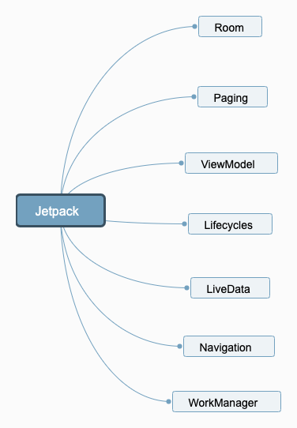

## Jetpack介绍

Jetpack是Android官方提供的一套开发组件的结合，它出现的目的是为了提高我们的开发效率，消除模板代码，构建高质量的强大应用。下面是准备分享的计划：




## Room介绍

Room是Jetpack组件中一个ORM库，它对Android原生的Sqlite Api做了一层抽象，从而简化开发者对数据库的操作。类似于市面上流程的ORM库GreenDao, Realm等。
Room不仅是Android在Jetpack中推荐使用的组件，更重要的是它在性能方面也有一定的优势。


本文关于Room会介绍主要是3个方面：

1. Room的配置
2. Room的使用
3. Room的源码解读


## Room的使用


#### Room配置

```

 def room_version = "1.1.1"

    implementation "android.arch.persistence.room:runtime:$room_version"
    annotationProcessor "android.arch.persistence.room:compiler:$room_version" // For Kotlin use kapt instead of annotationProcessor

    // optional - RxJava support for Room
    implementation "android.arch.persistence.room:rxjava2:$room_version"


```

## Room使用

在使用数据的时候，需要主要涉及到Room三个部分:

1. DataBase: 创建数据库实例
2. Entity: 数据库中表对应的实体
3. Dao： 操作数据库的方法

下面一一介绍

#### 创建Database实例

```

@Database(entities = {Video.class, User.class}, version = 1)
//@TypeConverters({Converters.class})
public abstract class AppDatabase extends RoomDatabase {

    private static AppDatabase INSTANCE;
    private static final Object sLock = new Object();

    public abstract UserDao userDao();

    public abstract VideoDao videoDao();


    public static AppDatabase getInstance(Context context) {
        synchronized (sLock) {
            if (INSTANCE == null) {
                INSTANCE =
                        Room.databaseBuilder(context.getApplicationContext(), AppDatabase.class, "video.db")
                                .allowMainThreadQueries() //room默认数据库的查询是不能在主线程中执行的，除非这样设置
                                .build();
            }
            return INSTANCE;
        }
    }
}


```

自定义一个抽象类,继承RoomDatabase。这里有几个问题需要注意一下：

1. 这个类是个抽象类，因为Room会给出其真正的实现。
2. 数据库实例的生成比较耗时，所以这个地方建议使用单例
3. @Database注解中 entity是要创建的表。
4. 需要提供获取dao的方法。


#### Entity

entity是表对应的实体，需要在该类上面添加@Entity注解

```

@Entity()
public class User {

    @PrimaryKey
    public int uid;

    @ColumnInfo(name = "name")
    public String name;

    @ColumnInfo(name = "video_id")
    public int videoId;

    @Ignore
    public List<Video>  videos;

}

```


这里介绍几个Entity用到的注解:


1. @Entity

标明是表的映射类，可以自定义表名称

```
@Entity(tableName = "Video")


```

2. @PrimaryKey

定义主键

```
    @PrimaryKey
    public int uid;

```

3. @ColumnInfo

自定义数据库中的字段名称

```
@ColumnInfo(name = "name")
    public String name;

```

4. @ForeignKey

定义外键约束

5. @Ignore

假如我们类中的某个字段不想在表中创建可以使用这个注解忽略。


```


@Entity(tableName = "Video", foreignKeys = @ForeignKey(entity = User.class,
        parentColumns = "uid", childColumns = "uid"))//可以指定表名，默认是类名
public class Video {

    @PrimaryKey
    public int vid;

    @ColumnInfo(name = "name")
    public String name;

    @ColumnInfo(name = "last_name")
    public String length;

    public int uid;

    @Ignore
    public String ignore;

}

```


#### Dao

Dao中提供了对数据库操作的方法。

```


@Dao
public interface UserDao {

    @Query("SELECT * FROM User")
    List<User> getAll();

    @Query("SELECT * FROM User WHERE uid IN (:userIds)")
    List<User> loadAllByIds(int[] userIds);

    @Query("SELECT * FROM User WHERE name LIKE :name ")
    User findByName(String name);

    @Insert
    void insertAll(User... users);

    @Delete
    void delete(User user);

    @Transaction //事务查询
    @Query("SELECT uid, name from User")
    List<UserAllVideos> loadUsers();


}


```

定义一个接口文件，添加@Dao注解，当然了它的实现也是由Room帮助我们完成的。各个方法根据业务需求去实现增删改查，这里也比较简单。


#### 场景类


```

 		User user = new User();
        user.uid = 1;
        user.name = "love";
    
        AppDatabase.getInstance(this).userDao().insertAll(user);


```

在数据库中插入一条User数据


```

 Video video = new Video();
        video.vid = 1;
        video.name = "love";
        video.length = "123";
        video.ignore = "ignore";
        video.uid = 1;
        AppDatabase.getInstance(this).videoDao().insertAll(video);


```

插入一条Video数据。

数据都插入了，现在我们获取一下数据。正常的单个表的数据应该是没什么问题的，就不演示了。这里只介绍一种情况就是关联查询,前面的内容我们通过外键的形式关联了User和Video。那我们怎么做才能在查询User的时候把关联的Video也同时查询出来呢。Room的做法如下：

创建一个UserAllVideos类,注意他不是Entity类，没有@Entity注解

```

public class UserAllVideos {

    @Embedded
    public User user;
    @Relation(parentColumn = "uid", entityColumn = "uid")
    public List<Video> videos;
}


```

这里涉及到两个注解解释一下：

1. @Embedded

他的作用是将User中的字段都引入

2. @Relation

他的作用类似于ForeignKey，就是关联了User和Video,用于我们的联合查询


之后在UserDao中添加一个查询的方法loadUsers，这样就能把User中的信息以及其关联的Video的信息全部的查询出来。

```

List<UserAllVideos> userAllVideos = AppDatabase.getInstance(this).userDao().loadUsers();
        Log.d(TAG, userAllVideos.get(0).videos.get(0).name);


```


#### TypeConverter


@TypeConverter的作用是转换，比如Room中不允许对象的引用出现，但是我们可以使用TypeConverter去转换，比如上面的User Entity中如果要添加List<Video>这种类型的字段，方法是创建个Converters类，定义两个转换方法，两个方法分别实现了String和List<Video>之前的相互转换。然后把Converters配置在Database中就可以了，代码如下：


```

public class Converters {

    @TypeConverter
    public static List<Video> revert(String str) {
        // 使用Gson方法把json格式的string转成List
        try {
            return new Gson().fromJson(str, new TypeToken<List<Video>>(){}.getType());
        } catch (Exception e) {
            e.printStackTrace();
        }finally {
            return null;
        }

    }

    @TypeConverter
    public static String converter(List<Video> videos) {
        // 使用Gson方法把List转成json格式的string，便于我们用的解析
        return new Gson().toJson(videos);
    }
}


```

在Database中配置TypeConverters
```

@Database(entities = {Video.class, User.class}, version = 1)
@TypeConverters({Converters.class})
public abstract class AppDatabase extends RoomDatabase {


```

#### 数据库升级

创建一个Migration，需要一个起始的版本和升级后的版本。migrage方法中是数据库升级的具体操作，然后在Database中配置Migration.如果涉及到多个版本的升级，也可以配置多个Migration

```

 static final Migration MIGRATION_1_2 = new Migration(1, 2) { //由1升级到版本2
        @Override
        public void migrate(SupportSQLiteDatabase database) {
            database.execSQL("CREATE TABLE Topic (id  INTEGER , name TEXT )");
        }
    };


Room.databaseBuilder(context.getApplicationContext(), AppDatabase.class, "video.db")
                                .allowMainThreadQueries() //room默认数据库的查询是不能在主线程中执行的，除非这样设置
                                .addMigrations(MIGRATION_1_2)
                                .build();

```

#### 集成RxJava2

Room支持RxJava2，返回的结果可以封装在Flowable中.

上面就是Room的基本使用，这个文档只是个入门，涉及到更详细的使用请再查询别的文档。下面简单的介绍一下Room的源码。


## Room源码介绍

gradle中依赖room，只能看到部分的源码，如果看完整的Room源码请点击[这里](https://android.googlesource.com/platform/frameworks/support/+/refs/tags/android-9.0.0_r41/room)。

#### 数据库实例创建

```
Room.databaseBuilder(context.getApplicationContext(), AppDatabase.class, "video.db")
                                .allowMainThreadQueries() //room默认数据库的查询是不能在主线程中执行的，除非这样设置
                                .addMigrations(MIGRATION_1_2)
                                .build();


```

这里一看应该就明白，Room采用了建造者模式，添加很多的配置，我们直接看build方法

```

        @NonNull
        public T build() {
            //noinspection ConstantConditions
            if (mContext == null) {
                throw new IllegalArgumentException("Cannot provide null context for the database.");
            }
            //noinspection ConstantConditions
            if (mDatabaseClass == null) {
                throw new IllegalArgumentException("Must provide an abstract class that"
                        + " extends RoomDatabase");
            }

            if (mMigrationStartAndEndVersions != null && mMigrationsNotRequiredFrom != null) {
                for (Integer version : mMigrationStartAndEndVersions) {
                    if (mMigrationsNotRequiredFrom.contains(version)) {
                        throw new IllegalArgumentException(
                                "Inconsistency detected. A Migration was supplied to "
                                        + "addMigration(Migration... migrations) that has a start "
                                        + "or end version equal to a start version supplied to "
                                        + "fallbackToDestructiveMigrationFrom(int... "
                                        + "startVersions). Start version: "
                                        + version);
                    }
                }
            }

            if (mFactory == null) {
                mFactory = new FrameworkSQLiteOpenHelperFactory();
            }
            DatabaseConfiguration configuration =
                    new DatabaseConfiguration(mContext, mName, mFactory, mMigrationContainer,
                            mCallbacks, mAllowMainThreadQueries,
                            mJournalMode.resolve(mContext),
                            mRequireMigration, mMigrationsNotRequiredFrom);
            T db = Room.getGeneratedImplementation(mDatabaseClass, DB_IMPL_SUFFIX);
            db.init(configuration);
            return db;
        }

```

这个方法的主要作用是创建数据库实例，然后初始化配置。在前面的使用部分，我们注意到AppDatabase是个抽象类，那他的真正实现其实在编译期已经生成了，位置在

```

build/generared/source/apt/debug/com.xray.sample.room/AppDatabase_Impl

```

他的实例化则是通过Room.getGeneratedImplementation方法完成，其实采用的是反射。


```

 static <T, C> T getGeneratedImplementation(Class<C> klass, String suffix) {
        final String fullPackage = klass.getPackage().getName();
        String name = klass.getCanonicalName();
        final String postPackageName = fullPackage.isEmpty()
                ? name
                : (name.substring(fullPackage.length() + 1));
        final String implName = postPackageName.replace('.', '_') + suffix;
        //noinspection TryWithIdenticalCatches
        try {

            @SuppressWarnings("unchecked")
            final Class<T> aClass = (Class<T>) Class.forName(
                    fullPackage.isEmpty() ? implName : fullPackage + "." + implName);
            return aClass.newInstance();
        } catch (ClassNotFoundException e) {
            throw new RuntimeException("cannot find implementation for "
                    + klass.getCanonicalName() + ". " + implName + " does not exist");
        } catch (IllegalAccessException e) {
            throw new RuntimeException("Cannot access the constructor"
                    + klass.getCanonicalName());
        } catch (InstantiationException e) {
            throw new RuntimeException("Failed to create an instance of "
                    + klass.getCanonicalName());
        }
    }

```


而真正数据库的创建是在init方法中


```

    @CallSuper
    public void init(@NonNull DatabaseConfiguration configuration) {
        mOpenHelper = createOpenHelper(configuration);
        boolean wal = false;
        if (Build.VERSION.SDK_INT >= Build.VERSION_CODES.JELLY_BEAN) {
            wal = configuration.journalMode == JournalMode.WRITE_AHEAD_LOGGING;
            mOpenHelper.setWriteAheadLoggingEnabled(wal);
        }
        mCallbacks = configuration.callbacks;
        mAllowMainThreadQueries = configuration.allowMainThreadQueries;
        mWriteAheadLoggingEnabled = wal;
    }


```

createOpenHelper这个方法，他的实现在AppDatabase_Impl中，代码很多，主要就是数据库的创建，表的创建，升级处理等。


#### Dao方法调用

还是在AppDatabase_Impl这个生成类中，我们找到了两个Dao实例化的地方，这里发现Dao的实现类也是在编译的时候生成的，UserDao_Impl和VideoDao_Impl

```

 @Override
  public UserDao userDao() {
    if (_userDao != null) {
      return _userDao;
    } else {
      synchronized(this) {
        if(_userDao == null) {
          _userDao = new UserDao_Impl(this);
        }
        return _userDao;
      }
    }
  }

  @Override
  public VideoDao videoDao() {
    if (_videoDao != null) {
      return _videoDao;
    } else {
      synchronized(this) {
        if(_videoDao == null) {
          _videoDao = new VideoDao_Impl(this);
        }
        return _videoDao;
      }
    }
  }


```
关于Dao的实现类大家自己去看吧，都是编译生成的模板代码。


#### 模板代码生成

Room模板代码的生成是通过注解处理器实现的，具体的源码在[这里](https://android.googlesource.com/platform/frameworks/support/+/refs/tags/android-9.0.0_r41/room/compiler/src/main/kotlin/androidx/room/RoomProcessor.kt),思路虽然简单，但是要理清里面的细节还是比较麻烦的。


## 思考

1. 为什么Room不允许在实体中存在对象对象引用
[链接](https://developer.android.com/training/data-storage/room/referencing-data)


## 参考文档

1. [room源码](https://android.googlesource.com/platform/frameworks/support/+/refs/tags/android-9.0.0_r41/room/)
2.  [room外键](https://www.bignerdranch.com/blog/room-data-storage-for-everyone/)
3.  [room存储复杂类型](https://www.jianshu.com/p/9c430196aac6)
4.  [room](http://blog.skymxc.com/2018/04/15/Room/)


