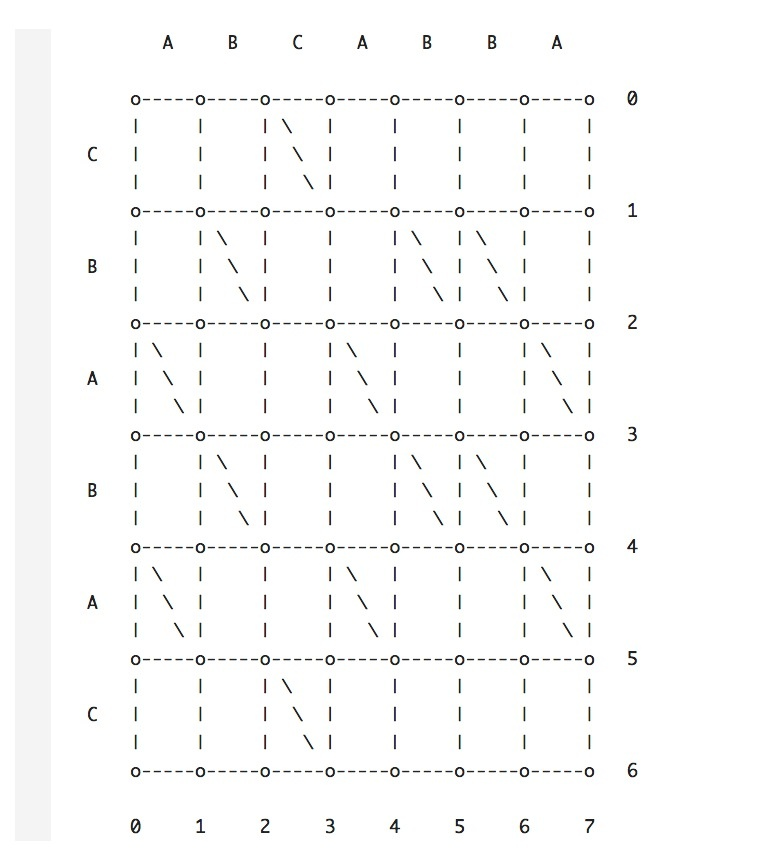
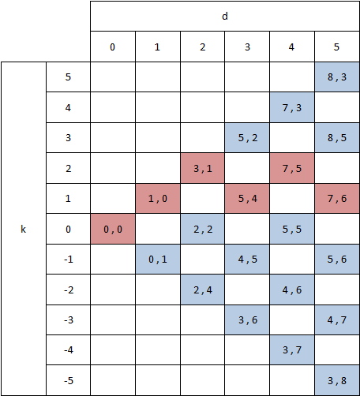

## 概述
RecyclerView中有许多神奇的特性，比如局部刷新，它不仅可以针对某个item进行刷新，也可以针对item中的某些数据进行刷新。这对我们页面的页面渲染带来了很大的提升。那么RecyclerView是怎么通过对新旧数据的对比来做到局部刷新的？更进一步，对比新旧数据的这个Diff算法又是什么的样子的。下面将会从这两个部分来展开讨论。

## RecyclerView的局部刷新

#### 局部刷新api

RecyclerView为了应对局部刷新提供了下面几个方法：

- mAdapter.notifyItemChanged(position)
- mAdapter.notifyItemInserted(position)
- mAdapter.notifyItemRemoved(position)
- mAdapter.notifyItemMoved(fromPosition, toPosition)

为了对数据集的改动还提供了notifyRange**系列的方法。但是这些方法在DiffUtil类出现之前其实使用的场景很有限。大部分情况都是直接的调用notifyDataSetChanged()方法。但是这个方法有一些明显的缺点：

- 不会触发Item动画
- 对整个可见区域进行刷新

#### DiffUtil实现局部刷新

上面说到其实RecyclerView是有提供局部刷新的方法的，但是这些方法很少被用到，原因是我们没有一个高效处理新旧数据差异的方法，直到DiffUtil类的出现。使用DiffUtil的话只需要关注两个类:

- DiffUtil.Callback

 我们需要通过这个类实现我们的diff规则。它有四个方法：

 - getOldListSize(int position)：旧数据集的长度。
 - getNewListSize(int position)：新数据集的长度。
 - areItemsTheSame(int position)：判断是否是同一个Item。
 - areContentsTheSame(int position)：如果是通一个Item，判断Item 的内容是否相同。

 下面简单的介绍一下方法3和方法4，areItemsTheSame判断是否是同一个item,一般使用item数据中的唯一id来判断,例如数据库中的id。areContentsTheSame 这个方法是在方法3返回true的时候才会被调用。要解决的问题是item中某些字段内容的刷新。例如朋友圈中更新点赞的状态。其实是不需要对整个item进行刷新的，只需要点赞所对应的控件进行刷新。


- DiffUtil.DiffResult
DiffUtil.DiffResult 保存了通过 DiffUtil.Callback 计算出来，两个数据集的差异。它是可以直接使用在 RecyclerView 上的。如果有必要，也是可以通过实现 ListUpdateCallback 接口，来比对这些差异。

上面这些内容会有个[demo](https://github.com/chengfangpeng/sample)帮助理解


## Diff算法
在上面使用RecyclerView做局部刷新的时候，使用了一个DiffUtil工具类。那么这个工具类是基于什么样的算法实现的？
要讲明白这个问题需先介绍一些概念

#### 概念解释

- 什么是diff
 diff是两个数据之间的区别（这里的数据可以是文件，字符串等等），也就是将源数据变成目标数据所需要的操作。我们研究diff算法就是找到一种操作最少的方式。


- Myers Diff算法  

 DiffUtil这个工具类使用的Diff算法来自于Eugene W. Myers在1986年发表的一篇算法[论文](http://xmailserver.org/diff2.pdf)


- 有向编辑图(Edit graph)
 

 算法依赖于新旧数据（定义为A和B构成的有向编辑图, 图中A为X轴, B为Y轴, 假定A和B的长度分别为M, N, 每个坐标代表了各自字符串中的一个字符. 在图中沿X轴前进代表删除A中的字符, 沿Y轴前进代表插入B中的字符. 在横坐标于纵坐标字符相同的地方, 会有一条对角线连接左上与右下两点, 表示不需任何编辑, 等价于路径长度为0. 算法的目标, 就是寻找到一个从坐标(0, 0)到(M, N)的最短路径

- Trace

  路径中斜线边的“匹配点”组成的序列,长度为L

- 最短编辑脚本(SES Shortest Edit Script)

  仅包含两种操作：删除和添加。从(0, 0)到(M, N)删除了N-L个字符，添加了M-L个字符，对于每一个trace,有一个对应的编辑脚本D = M + N - 2L

- 最长公共子序列(LCS Longest Common Subsequence)

  LCS是两个字符串中去掉一些字符后，所产生的共有的最长的字符串序列，注意，这与最长公共字符串是不同的，后者是必须连续的。寻找LCS其实就是寻找Trace的最大长度。

> 寻找LCS的问题与寻找一条从(0, 0)到(M, N)同时有最多数量的斜边是等价的

> 寻找SES与寻找一条从(0, 0)到(M, N)同时有最少数量的非斜边的问题是等价的


- snake(蛇形线)

 一条snake表示横(竖)方向移动一步后接着尽可能多的斜边方向的移动，组成的线


 - 斜线k

  k = x - y定义的一条直线，也就是k相同的点组成的一条直线。k线之间是相互平行的斜线。


 - D-path

 移动D步后的点的连线，D的大小是不包含斜线的数量的


#### 两个引理
 - 引理1
  *一个D-path的终点一定在斜线k上， 其中 k ∈ { -D, -D + 2, ... D -2 , D}* 。证明可以使用数学归纳法，详细证明见[论文](http://xmailserver.org/diff2.pdf)

 - 引理2

 0-path的最远到达点为(x, x)，其中x ∈ min(z - 1 || az ≠ bz or z > M 或 z > N)。D-path的最远到达点在k线上，可以被分解为在k-1 线上的(D-1)-path，跟着一条横向边，接着一条越长越好的斜边 和 在k+1 线上的(D-1)-path，跟着一条竖向边，接着一条越长越好的斜边 详细证明见[论文](http://xmailserver.org/diff2.pdf)

 这条引理是定义Snake的理论依据，另外此引理包含了一条贪婪原则: D-path可以通过贪婪地延伸(D-1)-path的最远到达点获得。
 这里可能还是不大明白，下面会详细的介绍这个过程。

#### 算法过程

 将上面那张图做个变换，得到下面的图:

 

 我们从坐标(0, 0)开始，此时，d=0，k=0，然后逐步增加d，计算每个k值下对应的最优坐标。

 因为每一步要么向右（x + 1），要么向下（y + 1），要么就是对角线（x和y都+1)，所以，当d=1时，k只可能有两个取值，要么是1，要么是-1。
 - 当d=1

   k=1时，最优坐标是(1, 0)。

   k=-1时，最优坐标是(0, 1)。

   因为d=1时，k要么是1，要么是-1，当d=2时，表示在d=1的基础上再走一步，k只有三个可能的取值，分别是-2，0，2。

 - 当d=2   

   k=-2时，最优坐标是(2, 4)。
   k=0时，最优坐标是(2, 2)。
   k=2时，最优坐标是(3, 1)。
   因为d=2时， k的取值是-2, 0, 2,所以当d=3时，表示只能在d=2的基础上再走一步。k的取值为 -3， -1， 1， 3

 - 当d=3

    k = -3时, 只能从k=-2向下移动，即(2, 4)向下移动至(2, 5)经斜线至(3, 6)，所以最优坐标是(3, 6)

    k = -1时，​可以由k=-2向右移动，即(2, 4)向右移动至(3, 4)经斜线至(4, 5)
    ​也可由k=0向下移动，即(2, 2)向下移动至(2, 3)
    ​因为同样在k = -1线上，(4, 5)比(2, 3)更远，所以最优坐标是(4, 5)

    k = 1时， 可以由k = 0向右移动，即(2, 2)向右移动至(3, 2)经斜线至(5, 4)， 也可由k = 2向下移动，即(3, 1)向下移动至(3, 2)经斜线 至(5, 4)，所以最优坐标是(5, 4)

    k = 3时, 只能从 k = 2 向右移动，即(3, 1)向右移动至(4, 1)经斜线至(5, 2),所以最优坐标是(5, 2)

 以此类推，直到我们找到一个d和k值，达到最终的目标坐标(7, 6)。


这个问题的解决用到了一个贪婪算法的原则：
   > D-path可以通过贪婪地延伸(D-1)-path的最远到达点获得

   通俗的理解就是一个问题的解决，依赖其子问题的最优解。

#### 代码实现

```
public class DiffSample {

    public static void main(String[] args) {

        String a = "ABCABBA";
        String b = "CBABAC";

        char[] aa = a.toCharArray();
        char[] bb = b.toCharArray();

        int max = aa.length + bb.length;

        int[] v = new int[max * 2];
        List<Snake> snakes = new ArrayList<>();

        for (int d = 0; d <= aa.length + bb.length; d++) {
            System.out.println("D:" + d);
            for (int k = -d; k <= d; k += 2) {
                System.out.print("k:" + k);
                // 向下 or 向右?
                boolean down = (k == -d || (k != d && v[k - 1 + max] < v[k + 1 + max]));
                int kPrev = down ? k + 1 : k - 1;

                // 开始坐标
                int xStart = v[kPrev + max];
                int yStart = xStart - kPrev;

                // 中间坐标
                int xMid = down ? xStart : xStart + 1;
                int yMid = xMid - k;

                // 终止坐标
                int xEnd = xMid;
                int yEnd = yMid;

                int snake = 0;
                while (xEnd < aa.length && yEnd < bb.length && aa[xEnd] == bb[yEnd]) {
                    xEnd++;
                    yEnd++;
                    snake++;
                }
                // 保存最终点
                v[k + max] = xEnd;
                // 记录 snake
                snakes.add(0, new Snake(xStart, yStart, xEnd, yEnd));
                System.out.print(", start:(" + xStart + "," + yStart + "), mid:(" + xMid + "," + yMid + "), end:(" + xEnd + "," + yEnd + ")\n");
                // 检查结果
                if (xEnd >= aa.length && yEnd >= bb.length) {
                    System.out.println("found");
                    Snake current = snakes.get(0);
                    System.out.println(String.format("(%2d, %2d)<-(%2d, %2d)", current.getxEnd(), current.getyEnd(), current.getxStart(), current.getyStart()));
                    for (int i = 1; i < snakes.size(); i++) {
                        Snake tmp = snakes.get(i);
                        if (tmp.getxEnd() == current.getxStart()
                                && tmp.getyEnd() == current.getyStart()) {
                            current = tmp;
                            System.out.println(String.format("(%2d, %2d)<-(%2d, %2d)", current.getxEnd(), current.getyEnd(), current.getxStart(), current.getyStart()));
                            if (current.getxStart() == 0 && current.getyStart() == 0) {
                                break;
                            }
                        }
                    }
                    return;
                }
            }
        }

    }

    public static class Snake {

        private int xStart;

        private int yStart;

        private int xEnd;

        private int yEnd;

        public Snake(int xStart, int yStart, int xEnd, int yEnd) {
            this.xStart = xStart;
            this.yStart = yStart;
            this.xEnd = xEnd;
            this.yEnd = yEnd;
        }

        public int getxStart() {
            return xStart;
        }

        public void setxStart(int xStart) {
            this.xStart = xStart;
        }

        public int getyStart() {
            return yStart;
        }

        public void setyStart(int yStart) {
            this.yStart = yStart;
        }

        public int getxEnd() {
            return xEnd;
        }

        public void setxEnd(int xEnd) {
            this.xEnd = xEnd;
        }

        public int getyEnd() {
            return yEnd;
        }

        public void setyEnd(int yEnd) {
            this.yEnd = yEnd;
        }
    }
}

```

## 参考文献
 1. [Investigating Myers' diff algorithm: Part 1 of 2](https://www.codeproject.com/articles/42279/investigating-myers-diff-algorithm-part-of)

 2. [简析Myers](https://juejin.im/post/5b0bbc806fb9a00a1451c058)
 3. [论文](http://xmailserver.org/diff2.pdf)
 4. [贪婪算法](https://time.geekbang.org/column/article/73188)
